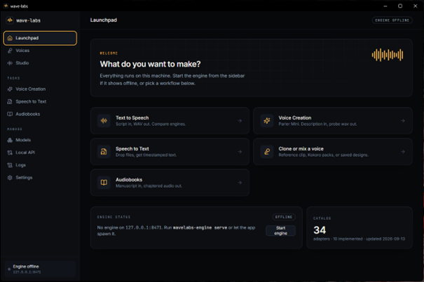

<div align="center">


# wave-labs

**Local-first speech lab.** Text to speech, transcription, voice cloning and voice design on top of Hugging Face models.

[](https://github.com/wagnerp4/wave-labs/actions/workflows/ci.yml)
[](https://github.com/wagnerp4/wave-labs/actions/workflows/deploy-web.yml)
[](https://github.com/wagnerp4/wave-labs/releases)
[](LICENSE)
<br>
[](https://github.com/wagnerp4/wave-labs)
[](https://github.com/wagnerp4/wave-labs)
[](https://github.com/wagnerp4/wave-labs/commits/main)
[](https://github.com/wagnerp4/wave-labs/commits/main)
[](https://github.com/wagnerp4/wave-labs/issues)
[](https://github.com/wagnerp4/wave-labs/stargazers)
<br>


[Website](https://wagnerp4.github.io/wave-labs/) · [Releases](https://github.com/wagnerp4/wave-labs/releases) · [Architecture](docs/ARCHITECTURE.md)



</div>

## Features

| | |
| --- | --- |
| 🗣️ **Text to Speech** | Script in, WAV out. Compare engines side by side. |
| ✨ **Voice Creation** | Parler Mini: describe a voice, probe it, save it. |
| 🎧 **Speech to Text** | Drop files, get timestamped text (`faster-whisper`). |
| 🧬 **Clone or mix a voice** | Reference clip, Kokoro packs, or saved designs. |
| 📚 **Audiobooks** | Manuscript in, chaptered audio out, with per-role casting. |
| 🔌 **Local API** | OpenAI-compatible HTTP API on `127.0.0.1:8471`. |

Ships as a website, desktop executables for Linux / macOS / Windows, and a local engine. Everything runs on your machine.

> [!NOTE]
> **Status:** structure, stack and UI scaffold. Studio TTS factories: `kokoro`, `chatterbox`, `xtts-v2`, `f5-tts`, `orpheus`, `cosyvoice2`, `dia`, `fish-speech`. ASR: `faster-whisper`. The rest of the catalog is still planned.

## Layout

| Path | What | Stack |
| --- | --- | --- |
| `apps/web` | Website: landing, models catalog, docs, download | Astro 5, React islands, Tailwind v4 |
| `apps/desktop` | Desktop app | Tauri 2, Vite, React 19, Tailwind v4 |
| `packages/registry` | Model catalog (`adapters.json`) + schema | TypeScript, zod |
| `packages/ui` | Design tokens and shared components | React, Tailwind v4 |
| `engine` | Local speech engine and HTTP API | Python 3.12, FastAPI, huggingface_hub, uv |

See `docs/ARCHITECTURE.md` for how the pieces fit.

## Prerequisites

- Node 20+ and pnpm 9 (`corepack enable` or `npm i -g pnpm`)
- uv (Python is managed by uv, 3.12 pinned in `engine/.python-version`)
- For native desktop builds: Rust stable plus the Tauri 2 system dependencies for your OS. On Debian/Ubuntu: `libwebkit2gtk-4.1-dev libappindicator3-dev librsvg2-dev patchelf pkg-config libssl-dev`

## Develop

<details>
<summary><b>WSL / Windows setup notes</b></summary>

The git tree lives in WSL at `/home/philipp/software/python/Signal Processing/Audio/Personal/wave-labs`. It is not under `C:\Software\Python\Audio\Personal\wave-labs`. Windows can browse it as `\\wsl.localhost\Debian\home\philipp\software\python\Signal Processing\Audio\Personal\wave-labs`. Do not `uv run` from PowerShell against that UNC path. `engine/.venv` is a Linux environment. Do not activate `SSL4SED/.venv` in this tree.

`wsl.exe` exists on Windows only. If the prompt is already Debian, skip the `wsl -d Debian --` wrapper.

</details>

Engine from Windows PowerShell (syncs Kokoro + Parler, then serves on `0.0.0.0:8471`):

> [!TIP]
> Port 8471 is often still held by an older `wavelabs-engine`. The next serve then exits with `address already in use`. This Debian image has no `fuser`. Stop the previous serve with Ctrl+C, or:

```powershell
wsl -d Debian -- bash -lc "pkill -f 'wavelabs-engine serve' || true; cd '/home/philipp/software/python/Signal Processing/Audio/Personal/wave-labs' && uv sync --directory engine && uv run --directory engine wavelabs-engine serve --host 0.0.0.0 --port 8471"
```

Desktop UI in a second PowerShell window. Open http://127.0.0.1:1420 from Windows. There is no `pnpm` on PATH in this WSL image. Use corepack:

```powershell
wsl -d Debian -- bash -lc "cd '/home/philipp/software/python/Signal Processing/Audio/Personal/wave-labs' && corepack pnpm --filter @wavelabs/desktop dev"
```

Same two steps already inside WSL (this is the prompt that printed `wsl: command not found`):

```bash
cd "/home/philipp/software/python/Signal Processing/Audio/Personal/wave-labs"
pkill -f "wavelabs-engine serve" || true
uv sync --directory engine
uv run --directory engine wavelabs-engine serve --host 0.0.0.0 --port 8471
```

```bash
cd "/home/philipp/software/python/Signal Processing/Audio/Personal/wave-labs"
corepack pnpm --filter @wavelabs/desktop dev
```

Kokoro and Parler-TTS are core engine dependencies (`transformers` 4.46.x). `uv sync --directory engine` is enough. Weights on disk (`Install weights`) are still required. Coqui/XTTS is not in this environment.

Unsigned `.ps1` files from `\\wsl.localhost\...` are blocked by execution policy. Use the `.cmd` launcher from Windows:

```powershell
\\wsl.localhost\Debian\home\philipp\software\python\Signal Processing\Audio\Personal\wave-labs\scripts\windows-dev.cmd
```

Override distro or path with `$env:WAVELABS_WSL_DISTRO` and `$env:WAVELABS_WSL_REPO`. Tauri `start_engine` on Windows uses the same variables (or a `\\wsl.localhost\...` engine path) and runs `wsl.exe` instead of Windows `uv`.

`pnpm dev:desktop:tauri` still needs a Windows Rust toolchain and WebView. Keep the engine in WSL. The MSI does not contain this checkout.

## Engine API

```
GET  /health
GET  /v1/models
GET  /v1/voices
POST /v1/voices/clone            multipart: name, file
POST /v1/voices/design           {"name":"...","description":"...","script":"..."}
POST /v1/models/{id}/download
POST /v1/voices/mix              {"name":"...","voices":["af_heart","af_bella"],"speed":1}
GET  /v1/voices/{id}/audio
DELETE /v1/voices/{id}
GET  /v1/books
POST /v1/books                   multipart: name, file
PATCH /v1/books/{id}/cast        {"roles":{"narrator":{"voice":"af_heart","adapter":"kokoro"}}}
POST /v1/books/{id}/render       ?chapter=
GET  /v1/books/{id}/chapters/{n}/audio
DELETE /v1/books/{id}
POST /v1/audio/speech            {"model":"kokoro","input":"...","voice":"af_heart"}
POST /v1/audio/transcriptions    multipart: model, file, language?, response_format?
```

Any OpenAI SDK works with `base_url="http://127.0.0.1:8471/v1"` and a dummy key.

## Build

```powershell
pnpm build                 # web + desktop frontend
pnpm build:desktop:tauri   # native installers into apps/desktop/src-tauri/target
```

Releases are produced by `.github/workflows/release-desktop.yml` on `v*` tags for Linux (`.deb`, `.rpm`, `.AppImage`), Windows (`.msi`, `.exe`) and macOS (`.dmg`, arm64 and x86_64).

## Notes

- The repo is on the WSL ext4 filesystem. `pnpm install` and `uv sync` belong in WSL. Windows `node_modules` / `engine/.venv` on the UNC share will not run in Linux, and the reverse is also true.
- Catalog licenses are copied from model cards at the time of writing and need verification before a release.

## License

[AGPL-3.0](LICENSE)
